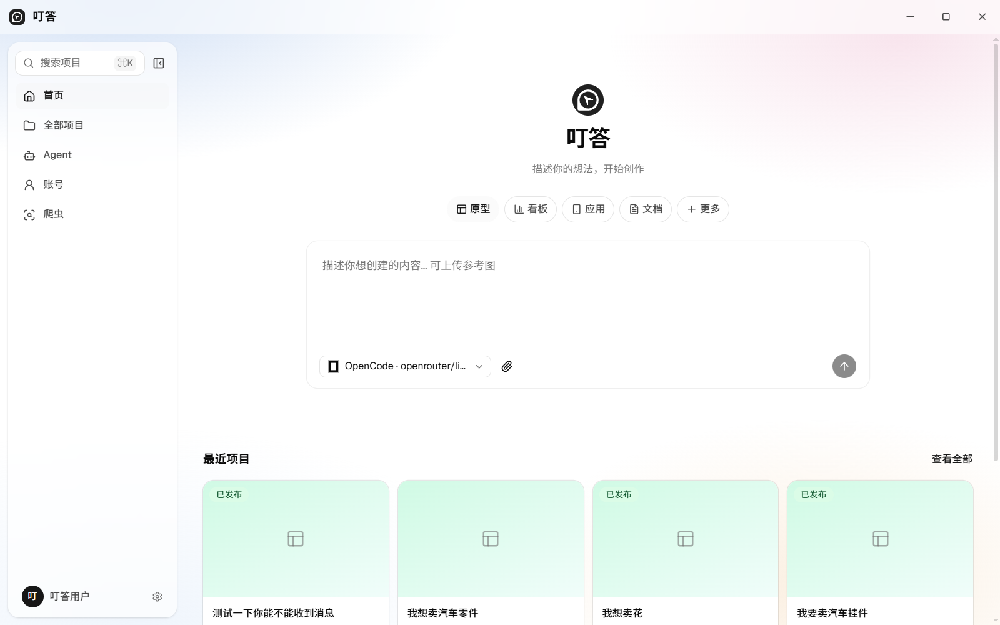
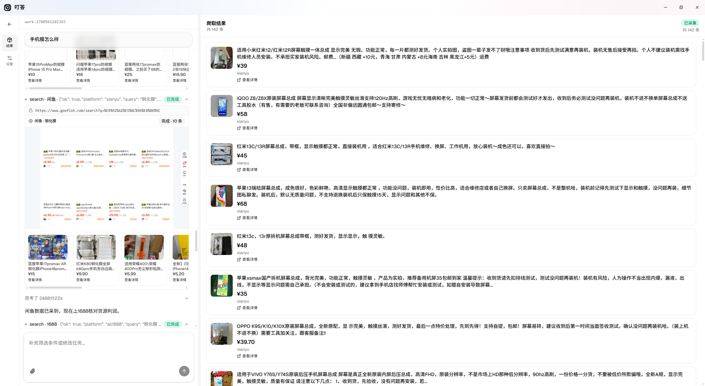
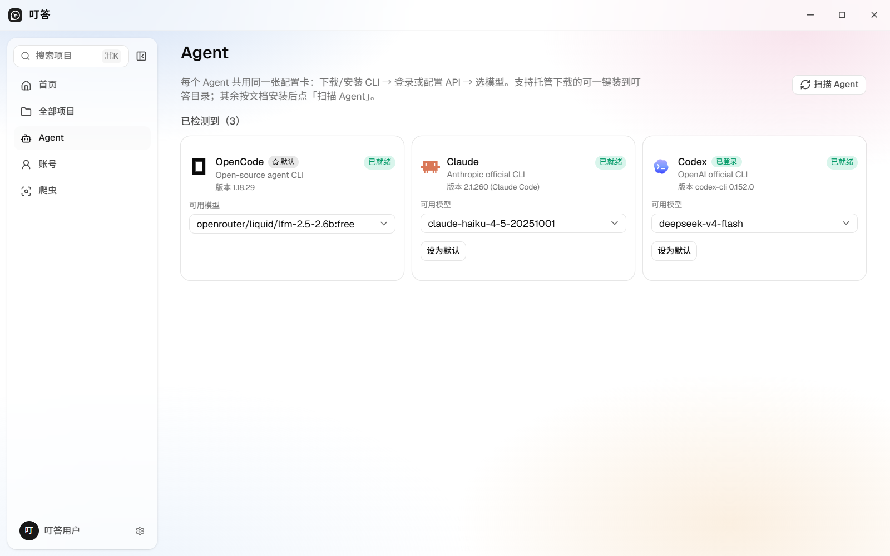

<p align="center">
  
</p>

<h1 align="center">叮答 DingDa</h1>

<p align="center">
  用自然语言做选品调研的桌面 Agent —— 接上 Codex / Claude / OpenCode，就能搜闲鱼、对 1688、采小红书。
</p>

<p align="center">
  
</p>

---

## Introduction

叮答是一个桌面端选品工作台：React 界面 + Tauri 壳 + Python Server。  
你在对话里描述需求，外部 CLI Agent（Codex / Claude / OpenCode）调用内置工具完成搜索、详情、比价与预览；爬虫过程可实时直播，撞风控或 DOM 改版时会自动恢复。

架构与分层约束见 [`AGENTS.md`](AGENTS.md)。

## Features

- **自然语言选品** — 一句话启动任务，支持原型 / 看板 / 应用 / 文档等入口
- **多平台爬虫** — 闲鱼 · 1688 · 小红书；1688 支持图搜 / 链接搜同款比价（销量最高 / 价格最低 / 严选）
- **步骤实时直播** — 采集过程推送截图帧，打开页、翻页、进详情全程可见
- **风控自动恢复** — 先自动过滑块；失败则弹有头窗口等人，Cookie 写回后从断点续跑
- **DOM 自动修复** — 厂家改版导致选择器失效时，指纹重定位 + AI 修抽取规则，验证通过后热加载继续采
- **Codex 即插即用** — Agent 页安装登录即可；运行时注入 `dingda-mcp`（`search` / `product` / `compare` / `preview`）
- **多 Agent 管理** — OpenCode / Claude / Codex 同屏：版本、模型、默认 Agent 一键切换
- **本地一体** — 数据与浏览器会话跑在本机，不依赖远程爬虫 SaaS

## Screenshots

| 首页 | 爬虫过程 | Agent 配置 |
| :--: | :------: | :--------: |
|  |  |  |

**爬虫工作台**：左侧 Agent 轨迹，中间步骤直播，右侧结构化结果（标题 / 价格 / 来源 / 详情）。

**Agent 页**：托管 CLI 一键安装，本地 CLI 一键扫描；设好默认 Agent 后，首页与爬虫页直接复用。

## Get Started

### 开发运行

```bash
pnpm install
pnpm prepare:server   # uv sync --frozen（server/）
pnpm tauri dev        # 桌面壳 + 前端

# 仅 Web 联调（默认 API http://127.0.0.1:8787）
pnpm dev
```

### 接上 Codex 就能用

1. 打开 **Agent** 页，安装并登录 **Codex**（或 Claude / OpenCode）
2. 选好模型，设为默认，状态显示「已就绪」
3. 回首页或爬虫页，用自然语言描述选品 / 调研任务

工具经 `dingda-mcp` 注入，无需手写第二套爬虫脚本。

## How it works

```text
用户一句话
    → Codex / Claude / OpenCode
    → dingda-mcp：search / product / compare / preview
    → Crawler（闲鱼 / 1688 / 小红书）
         ├─ 步骤直播截图 → 界面
         ├─ 风控 → 自动滑块 / 有头人工 → Cookie 回写
         └─ DOM 失效 → 指纹重定位 / AI 修选择器 → 热加载
    → 结构化结果（价格 · 货源 · 利润对照）
```

## Repository

```text
src/          Web UI（React）
server/       Python Server（API / Agent / Crawler / Browser / MCP）
src-tauri/    桌面壳（起停 Server、OS 能力、外部 CLI）
public/       品牌资源与截图
```

更多目录说明见 [`AGENTS.md`](AGENTS.md) 与 `server/src/README.md`。
