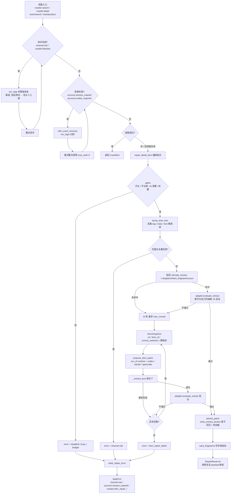
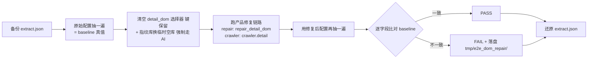

# DOM 自动修复：完整链路与验证记录

多平台（闲鱼 / 小红书）AI 辅助 DOM 自动修复的**现状快照**：编排全链路、验证脚本挂载点、
以及真机跑过的结果与修掉的 bug。

---

## 一、编排链路（现状）



关键设计：**验证器就是平台自己的抽取脚本**。AI 出的选择器必须让 `DETAIL_DOM_JS` /
`DOM_DETAIL_JS` 真的抽出内容（`payload_ok`）才算通过，通不过就进下一轮，轮数耗尽才报错。

---

## 二、验证脚本挂载点

`packages-py/api/scripts/e2e_dom_repair.py` —— 只做外壳，编排一律复用产品代码。



复用的产品方法（脚本内无自研编排）：

| 环节 | 用到的产品方法 |
| --- | --- |
| 编排 | `orchestrator.repair_detail_dom` |
| 验证 | `adapter.evaluate_extract` → 平台 `DETAIL_DOM_JS` / `DOM_DETAIL_JS` |
| 平台插座 | `_XIANYU_ADAPTER` / `_XHS_ADAPTER`（`current_selectors` / `required_fields` / `dump_roots` / `payload_ok`） |
| 页面适配 | crawler 内的 `_RawPageView` |
| 顶层入口 | `create_crawler` + `crawler.detail` |
| 写回 | `persist_patch` → `write_extract_section` |
| CLI | `propose_dom_patch` → `run_cli` |

> 例外：清空配置那一步自己写 JSON（`write_extract_section` 是按 key 合并，只能覆盖不能清空），
> 并整文件备份确保能还原。

用法：

```bash
cd server
.venv/Scripts/python.exe scripts/e2e_dom_repair.py --platform xianyu --item-id <id>
.venv/Scripts/python.exe scripts/e2e_dom_repair.py --platform xiaohongshu --keyword 咖啡 --mode crawler
.venv/Scripts/python.exe scripts/e2e_dom_repair.py --platform xianyu --item-id <id> --runtime claude
```

`--mode repair` 直接调编排（两种平台都确定）；`--mode crawler` 走平台 `detail()`
（小红书必须用这个，弹层才渲染）。

---

## 三、真机结果

| runtime | 平台 | 模式 | 结果 | 说明 |
| --- | --- | --- | --- | --- |
| codex（默认） | 闲鱼 | repair | **PASS** | AI 自出 `desc: [class*="desc--"]` 等，与原始选择器完全不同但抽取逐字段一致 |
| codex（默认） | 小红书 | crawler | **PASS** | `via=detail_dom_repair`，标题 + 作者全对 |
| opencode | 闲鱼 | repair | **FAIL** | opencode 自身起不来，非本链路问题（见下） |

### opencode 不可用（环境问题，非链路 bug）

```
repair cli error: Unexpected server error. Check server logs for details.
```

独立于本仓库复现：裸跑 `opencode run "..."` 同样报错。三层原因：

1. `~/.config/opencode/opencode.json` **没配默认 model** → 会话记录里 `model=undefined` → 服务端报错。
2. 显式指定 `openrouter/~anthropic/...` → `This model is not available in your region.`
3. 换 opencode 自带免费模型 → `unknown certificate verification error`（TLS/证书链）。

要在本机用 opencode 当修复 runtime，需先在其配置里选一个在本区域可用、且证书链正常的模型。

---

## 四、本轮修掉的 bug

| # | 位置 | 症状 | 修法 |
| --- | --- | --- | --- |
| ① | `cli/repair/propose.py` `_extract_json` | CLI 把推理与答案混在一条流里，贪婪正则 `\{[\s\S]*\}` 从推理里第一个 `{` 吃到答案的最后一个 `}`，必然解析失败 → **每一轮 AI 补丁都被丢弃**，报 `crawler.dom_repair_failed` | 改为括号配对扫描；推理里有落单 `{` 时退化为「最长可解析块」。新增 9 条单测 |
| ② | `sources/xiaohongshu/crawler.py` 详情修复段 | `repair_detail_dom` 成功后跟了一句**无条件** `raise AppError("crawler.extract_failed", ...)` → 小红书修复成功路径永远走不到 | 删掉该 raise；修好就继续往下走 |
| ③ | `sources/xiaohongshu/crawler.py` 修复闸门 | 闸门只看 `item.title`，作者选择器烂掉时静默返回空作者、一次修复都不触发 | 新增 `_needs_repair()`（标题或作者缺一即修）；硬失败仍只认标题 |
| ④ | `sources/xiaohongshu/extract.json` `title_noise` | 选择器空掉后 `DOM_DETAIL_JS` 兜底取 `document.title`，`小红书 - 你的生活兴趣社区` 被当成正常笔记标题接受 | 把站点默认标题加进 `title_noise` |
| ⑤ | `cli/base.py` + `cli/repair/propose.py` | 修复子 agent 走的是普通 `run_cli`：被拼上父 agent 的 `system.md`（2338 字选品人设）+ 平台提示（还反向指挥它调 `search`/`product`），且那 5 个工具真的注入 —— 与「禁止调用任何选品工具」自相矛盾 | `run_cli(bare=True)`：原样发 prompt、`mcp_mode="none"` 不注入 MCP、cwd 落到系统临时目录（`_bare_workdir()`，不进仓库）。修复调用改传 `bare=True` |

| ⑥ | `repair/types.py` + `orchestrator.py` + `cli/repair/propose.py` | 修复轮次之间只传「上次失败的选择器」，**不传失败原因**（payload / error）；每轮还是新进程，上一轮推理也丢 —— codex 实际在盲改 | `DomSnapshot` 加 `last_error` / `last_payload`；编排器逐轮累积现场（含指纹轮），`_user_prompt` 渲染 `last_attempt_error` / `last_attempt_payload` |

| ⑦ | `sources/xianyu/repair_adapter.py` `dump_roots()` | dump 根只有 `item-main-container`（+ `body` 兜底）。卖家区是它的**兄弟**，从 `body` 数下来是第 7 层 > `maxDepth=6` → 昵称/简介元素被整片截掉，dump 里搜不到「小酥」。AI 看不到元素，只能退而选空壳容器，`seller_name` 抽成 `失眠小酥 深圳 17分钟前来过 来闲鱼5年 卖出13171件` | `dump_roots()` 把 `[class*="item-user-container"]` 也当根（子树从浅层展开），`body` 留作兜底 |
| ⑧ | `cli/repair/propose.py` 提示词 | 提示词只有一句话：没说清「每个选择器会被单独 `document.querySelector` 执行，多套一层容器就会把兄弟节点文案一起抓进来」，也没说 `dom_tree` 的 `text` 只是该节点的直接文本、`kids` 为空不代表没有子元素。另外 AI 多吐的键会被当选择器写进 `extract.json` | 重写提示词（选择器怎么被使用 / dom_tree 怎么读 / 规则 6 条 / 输出契约）；解析侧只收本 section 已有的字段名 |

回归：全量 `230 passed / 8 failed`，8 个均为既有失败；`codegraph sync` 已刷新。

---

## 五、可信度警告：修复子 agent 能读到答案

真机跑通过程中发现，**「AI 自己从 DOM 推出选择器」这个结论目前不能完全采信**。两条泄漏路径：

1. **测试脚本自己漏**（已修）：备份文件原来放成 `extract.json.e2e-bak`，就躺在 `extract.json` 旁边，整个修复期间都在。备份已改到仓库外的临时目录。
2. **代码侧 sandbox 太宽**（未修）：本机 Windows 下 `CodexRuntime.build_args` 走
   `--sandbox danger-full-access`，而修复 spawn 没传 `cwd`，`CliRuntime.run` 的 `workdir` 落到
   `Path.cwd()` = 仓库根。于是子 agent 可以读仓库里任何文件，包括
   `sources/xianyu/DOM_PROBE.md`（里面记着 detail_dom 的原始选择器）和 git 历史。

证据：第一次 codex 修复（`tmp/e2e_dom_repair/xianyu_...151207.json`）最终输出的
`seller_nick` / `seller_intro` 与 `extract.json` 原值、`DOM_PROBE.md` 记录**逐字相同**，
而这两个 class 在 dump 树里从未出现（codex 自己的推理也写着 "Text is not in provided tree, kids empty"）。
它得出这两个名字，最可能就是读到了文件。

**因此**：表格里 codex 的两次 PASS 需要打折看待。第二轮（`...151407`）的选择器与原始配置
不同（`[class*="item-user-info-container"] [class*="nick"]`），是它自己推的，大概率干净；
但第一轮的输出与文档逐字相同，说明泄漏这条路是通的。

要把这条测试做实，需要两手一起，**两手都已做**：

1. 备份挪出仓库（`scripts/e2e_dom_repair.py` → 系统临时目录）
2. 修复 spawn 的 `cwd` 移出仓库（`cli/base.py` 的 `_bare_workdir()` → `dingda-bare-agent-*` 临时目录）

做完后重跑（`xianyu_...155339.json`）：`MCP 服务器：未注入（bare 隔离）`、
五个字段（含 `seller_name`）全对、`source=ai` —— 这轮是**干净**的 PASS。

**残留风险**：本机 codex 是 `--sandbox danger-full-access`，cwd 隔离只挡住了「顺手翻当前目录」，
挡不住它主动用绝对路径去读仓库。要彻底封死得靠 sandbox 策略（Windows 上 codex 似乎收不紧），
或者干脆换一个能在本机正常工作的 runtime。


### 附带发现：dump 没暴露卖家子树

最新一轮（bare）AI 把 `seller_nick` 选成了**容器** `[class*="item-user-container"] [class*="item-user-info-container"]`，
抓进来的文本是 `失眠小酥 深圳 1分钟前来过 来闲鱼5年 卖出13171件 好评率89%`（正确值只有前缀 `失眠小酥`）。
原因是 dump 树里 `item-user-info-container--dUqo4L0b` 的 `kids` 是**空数组**，AI 看不到里面那个
`...-nick...` 元素，只能退而选容器。这直接影响 AI 能不能选到精确节点，值得单独查
（是 `dump.py` 的 `maxChildren` / `maxDepth` 截断，还是渲染时序）。

