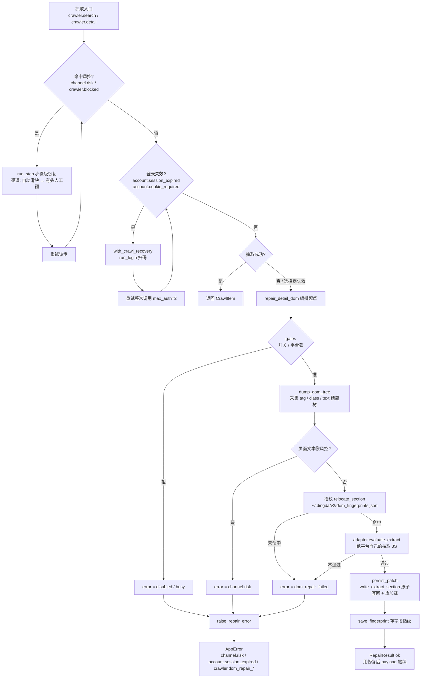

# DOM 自动修复：现状

多平台（闲鱼 / 小红书）DOM 自动修复的**现状快照**：编排链路、设计取舍、已知短板。

> 本文原先记录的是「指纹 + AI 补丁」两轮链路。AI 补丁轮（`cli/repair/propose.py`、
> `run_cli`）随外部 CLI 对接一并删除，现在**只剩指纹重定位一轮**：抽不到就判失败。
> 下面描述的是删除后的状态。

---

## 一、编排链路（现状）

关键设计：**验证器就是平台自己的抽取脚本**。指纹给出的选择器必须让 `DETAIL_DOM_JS` /
`DOM_DETAIL_JS` 真的抽出内容（`adapter.payload_ok`）才算通过；通过后写回
`extract.json` 并落指纹，下次同类 DOM 变化可直接命中指纹、不必再推理。

`orchestrator.py` 结束时 `release_platform()`，平台锁保证同一平台不会并发修复。

---

## 二、真机修掉的两个坑（设计由此而来）

### ① `dump_roots()` 只给一个根 → 卖家区被截掉

`adapter.dump_roots()` 原来只返回 `item-main-container`（+ `body` 兜底）。卖家区是它的
**兄弟**节点，从 `body` 数下来是第 7 层，超过 `maxDepth=6` → 昵称/简介元素被整片截掉，
精简树里根本没有。

所以 `sources/xianyu/repair_adapter.py` 的 `dump_roots()` 把
`[class*="item-user-container"]` 也当根（子树从浅层展开），`body` 留作兜底。
**新增平台适配器时注意**：dump 根要覆盖所有会被抽字段的子树，别只给主容器。

### ② `title_noise` 没盖住站点默认标题

选择器空掉后 `DOM_DETAIL_JS` 会兜底取 `document.title`，于是
`小红书 - 你的生活兴趣社区` 被当成正常笔记标题接受，修复闸门因此不触发。
解法：把站点默认标题加进 `extract.json` 的 `title_noise`。

---

## 三、已知短板

- **指纹未命中即失败**：AI 补丁轮删除后没有兜底。首见的新 DOM 结构必须有人补
  `extract.json`，或实现自己的补丁发动机再接回来。
- **`gates` 里的 AI 预算形同虚设**：`consume_ai_budget()` / `max_rounds()` 仍在，
  但已无调用方；`DINGDA_DOM_REPAIR_ROUNDS` / `DINGDA_DOM_REPAIR_BUDGET` 两个环境变量
  目前不产生任何效果。
- **`bridge.py` / `DomSnapshot` 仅剩测试在用**：`api/tests/crawler/test_repair_bridge.py`
  还覆盖着，产品路径已不经过它们。
