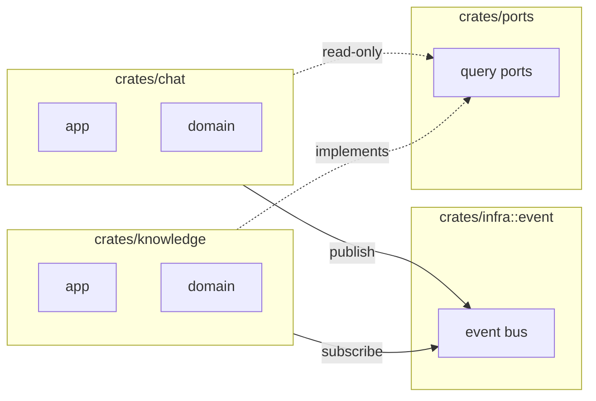

# Feature Boundary

Feature 是 DingDa 的最小业务垂直单元。每个 Feature 在 Rust、React、Contract 中拥有独立命名空间。

## Feature 列表

```
agent · chat · knowledge · platform · discovery
```

横切能力不进 `features/`：共享组合在 `src/components/`，授权在 `src/license/`，错误与启动在 `src/lifecycle/`，设置弹窗在 `src/app/settings/`。

## 隔离模型



## 允许 vs 禁止

| ✅ 允许 | ❌ 禁止 |
|---------|---------|
| Feature → `infra::event`（发布/订阅） | `use knowledge::` inside `chat` |
| Feature → `ports` trait（Query Port） | `chat` crate 依赖 `knowledge` crate |
| Feature → `contracts` DTO | Feature UI import 另一 Feature 内部模块 |
| Feature → `common`（DTO/事件） | 共享可变全局状态 |

## 每个 Feature 的标准结构

### Rust（`apps/desktop/src-tauri/`）

业务 UseCase 与 Tauri commands 放在 `src-tauri`；`crates/` 仅放基础设施。

```
crates/<ability>/src/           # 能力包（agent / platform / infra）
├── <module>/                   # 功能文件夹（如 agent::model）
└── lib.rs                      # lib 编排

business/src/                   # 应用胶水（logging / config / channel / event_sink / timing）

apps/desktop/src-tauri/src/     # Tauri 应用壳
├── platforms/                  # 平台装配
├── shared/                     # 共享 IPC 基建
└── lib.rs                      # builder / invoke_handler
```

### React (`apps/desktop/src/features/<feature>/`)

```
features/<feature>/
├── index.ts          # Feature 注册（id、路由元数据）
├── pages/            # 页面组件
├── components/       # Feature 私有组件
└── hooks/            # Feature 私有 hooks（调 platform/ipc）
```

### Contract (`contracts/schema/v1/<feature>/`)

```
contracts/schema/v1/<feature>/
├── dto/              # 数据传输对象
├── ipc/              # Tauri 命令 DTO
├── event/            # 事件 payload
└── error/            # 错误码
```

## 跨 Feature 协作模式

### 模式 A：Event（写操作 / 状态变更）

```
chat 发布 MessageSent  →  infra::event  →  knowledge 订阅索引
```

### 模式 B：Query Port（只读查询）

```rust
// crates/ports/src/chat_query.rs
pub trait ChatQueryPort: Send + Sync {
    fn thread_summary(&self, thread_id: &str) -> Result<ThreadSummary, PortError>;
}
```

### 模式 C：Contract（共享 DTO）

两端使用同一 JSON Schema 生成的类型，无运行时耦合。

## 新增 Feature

见 [../recipes/add-feature.md](../recipes/add-feature.md)。

## 相关文档

- [event.md](event.md)
- [../recipes/add-query-port.md](../recipes/add-query-port.md)
