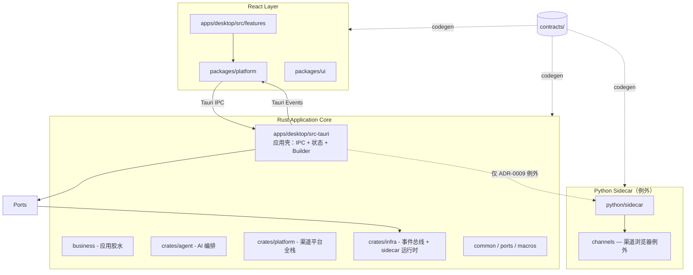

# Architecture Overview

DingDa 是企业级 AI 智能客服桌面平台，采用契约驱动开发。默认实现语言是 **Rust**；Python Sidecar 只补 Rust 生态缺口，不是 AI Runtime。

## 系统全景



## 技术栈

| 层 | 技术 |
|----|------|
| 桌面壳 | Tauri 2 |
| 前端 | React · TypeScript · Vite · pnpm workspace |
| 核心（默认含 AI） | Rust Workspace · SQLite（经 platform::storage） |
| 例外 Sidecar | Python · 仅 Rust 生态不够时 |
| 契约 | JSON Schema · OpenAPI · codegen |

## 当前阶段

**Architecture Skeleton** — 允许目录、crate、trait、DTO、Contract、Interface、Mock；禁止业务逻辑与 Demo。现有 Python ping 骨架不表示 AI 必须走 Python。

## 关键目录

| 路径 | 职责 |
|------|------|
| `apps/desktop` | Tauri + React 桌面应用 |
| `packages/ui` | 纯 UI 组件（无 IPC/业务） |
| `packages/platform` | IPC · OS API · 窗口 |
| `packages/contracts` | 前端契约类型（codegen） |
| `crates/` | Rust 基础设施（业务代码在 src-tauri） |
| `python/` | 例外 Sidecar（非 AI Runtime） |
| `contracts/` | 跨端共享契约（唯一真相源） |

## 数据流（流式 AI 输出）

```
默认：Rust（生成 token）  →  Tauri Events  →  React
例外：Python sidecar  →  Rust（聚合/鉴权/日志）  →  Tauri Events  →  React
```

禁止 Python 直接向 React 推送事件。

## 相关文档

- [principles.md](principles.md) — 设计原则
- [layers.md](layers.md) — 分层职责
- [feature-boundary.md](feature-boundary.md) — Feature 隔离
- [contracts.md](contracts.md) — 契约流程
- [event.md](event.md) — 事件总线
- [dependency.md](dependency.md) — 依赖规则
